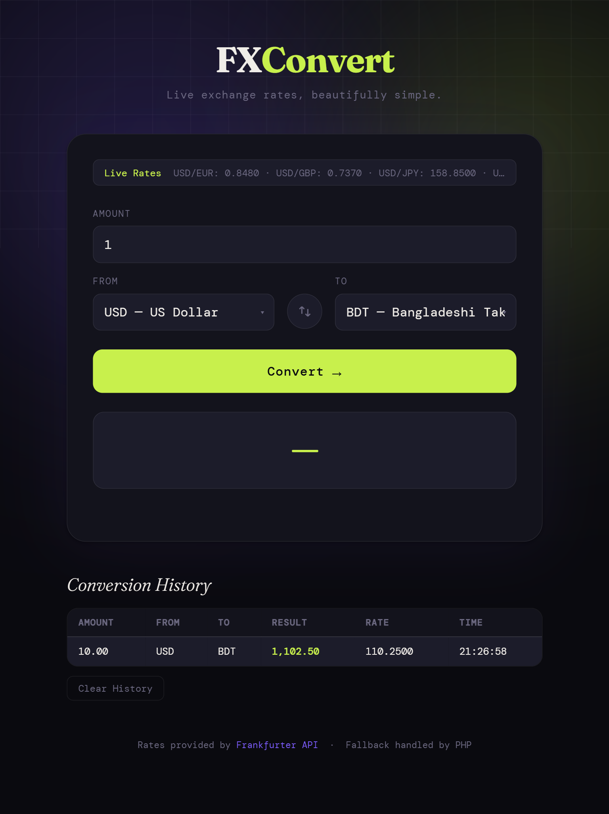
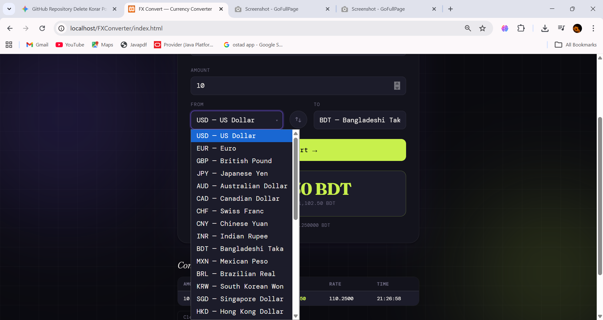
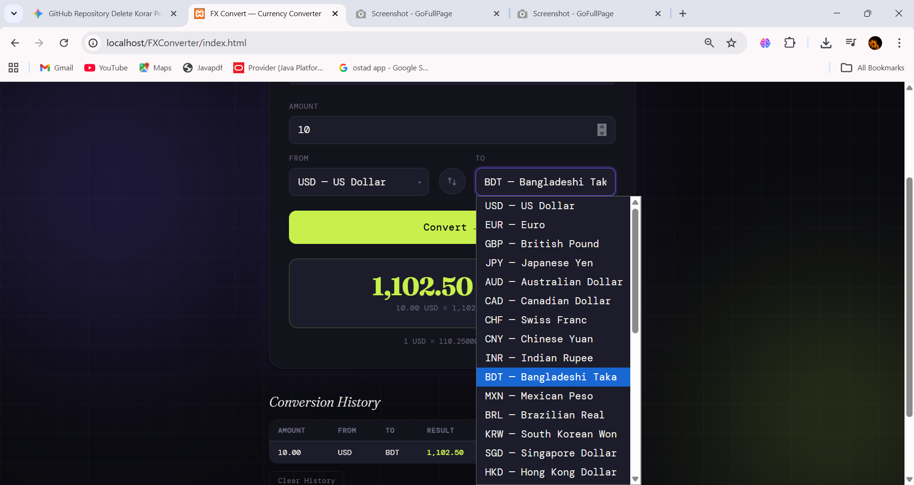
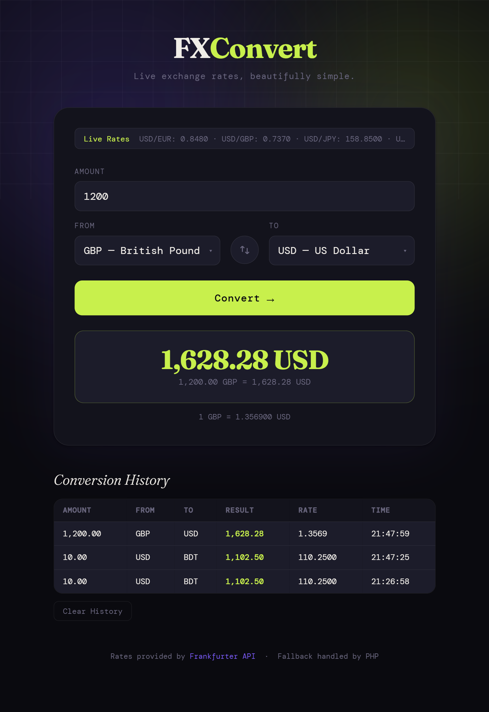
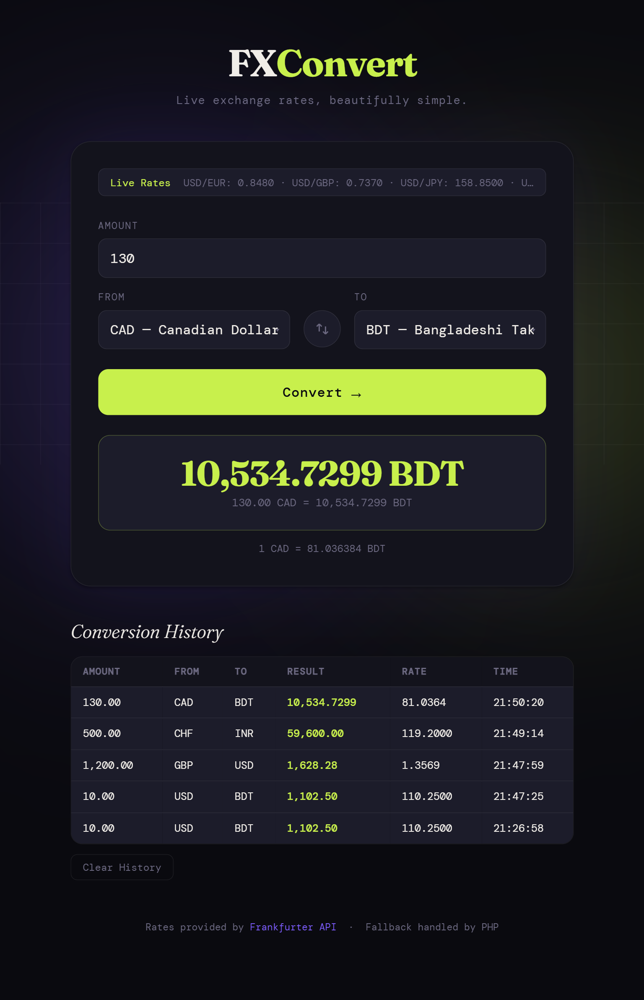

# 💱 FX Convert — Currency Converter Web Application


### 📌 Overview
**FX Convert** is a modern, responsive web-based currency converter application. It provides live exchange rates using the **Frankfurter API** and features a robust **PHP-based fallback system** to ensure functionality even during API downtime or offline situations.

---

### ✨ Features
* 🌍 **Live Rates:** Real-time currency conversion using a public REST API.
* 🔄 **Smart Swap:** Instantly switch between "From" and "To" currencies.
* 💾 **Conversion History:** Automatically saves your recent activities using browser `localStorage`.
* 📊 **30+ Currencies:** Support for all major global currencies.
* 📱 **Fully Responsive:** Seamless experience across Mobile, Tablet, and Desktop.
* 📴 **Smart Fallback:** Automatically utilizes PHP-stored rates if the API connection fails.
* 🔐 **Data Validation:** Secure and precise handling of numerical input.

---

### 🛠️ Technologies Used
* **Frontend:** HTML5, CSS3, JavaScript (Vanilla JS)
* **Backend:** PHP
* **API:** [Frankfurter API](https://api.frankfurter.app/latest)
* **Storage:** Browser LocalStorage (for History)

---

### 🚀 Setup & Installation
1.  **Requirement:** Install [XAMPP](https://www.apachefriends.org/) or any local PHP server.
2.  **Project Path:** Move the project folder to:
    `C:\xampp\htdocs\FXConverter`
3.  **Start Server:** Launch XAMPP Control Panel and start **Apache**.
4.  **Run Application:** Open your browser and navigate to:
    `http://localhost/FXConverter/index.html`

---

### 📁 Project Structure
```text
FXConverter/
│── index.html         # Main User Interface
│── style.css          # Styling & Layout
│── script.js          # Frontend Logic & API Integration
│── convert.php        # Backend API Handler & Fallback System
└── screenshots/       # UI Preview Images

---
### 📸 Visual Previews

| 🏠 Home Page | 🔄 Selection (From) |
|---|---|
|  |  |

| 🎯 Selection (To) | 💱 Conversion Result |
|---|---|
|  |  |

| 📊 History Section |
|---|
|  |
---

👨‍🎓 Author
Sumaiya Islam Chowdhury
